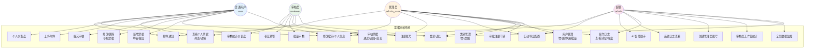

# 票据审核系统 — 用例图

```mermaid
graph TD
    subgraph 票据审核系统
        A[注册账号]
        B[登录/退出]
        C[新增票据<br/>草稿/提交]
        D[修改/删除<br/>草稿票据]
        E[提交审核]
        F[查看个人票据<br/>列表/详情]
        G[上传附件]
        H[审核票据<br/>通过/退回+意见]
        I[批量审核]
        J[积压预警]
        K[审核统计仪表盘]
        L[个人仪表盘]
        M[用户管理<br/>增/删/停用/批量]
        N[审批注册申请]
        O[类别管理<br/>增/改/删]
        P[操作日志<br/>查看/清空/导出]
        Q[全局数据监控]
        R[审核员工作量统计]
        S[创建管理员账号]
        T[系统日志查看]
        U[AI 智能助手]
        V[自动导出配置]
        W[修改密码/个人信息]
        X[邮件通知]
    end

    %% 普通用户
    USER((普通用户<br/>user))
    USER --> A
    USER --> B
    USER --> C
    USER --> D
    USER --> E
    USER --> F
    USER --> G
    USER --> L
    USER --> W
    USER --> X

    %% 审核员
    REVIEWER((审核员<br/>reviewer))
    REVIEWER --> B
    REVIEWER --> F
    REVIEWER --> H
    REVIEWER --> I
    REVIEWER --> J
    REVIEWER --> K
    REVIEWER --> W

    %% 管理员
    ADMIN_USER((管理员<br/>admin_user))
    ADMIN_USER --> B
    ADMIN_USER --> M
    ADMIN_USER --> N
    ADMIN_USER --> O
    ADMIN_USER --> P
    ADMIN_USER --> V
    ADMIN_USER --> A
    ADMIN_USER --> W
    ADMIN_USER --> X

    %% 超管
    ADMIN((超管<br/>admin))
    ADMIN --> B
    ADMIN --> Q
    ADMIN --> R
    ADMIN --> S
    ADMIN --> P
    ADMIN --> T
    ADMIN --> U
    ADMIN --> V
    ADMIN --> W

    style USER fill:#E3F2FD
    style REVIEWER fill:#E8F5E9
    style ADMIN_USER fill:#FFF3E0
    style ADMIN fill:#FCE4EC
```
